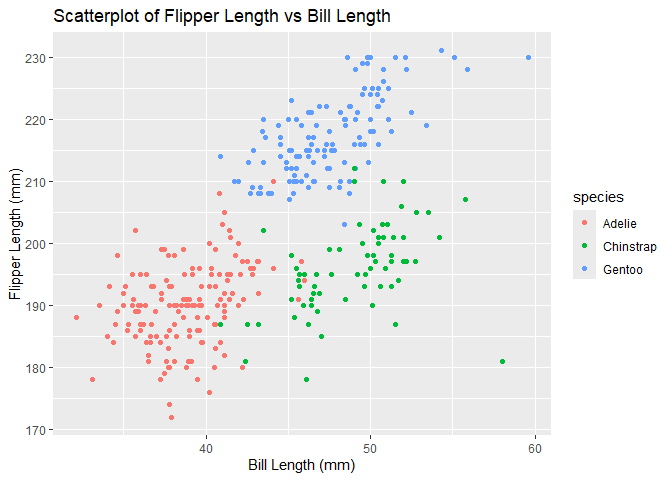

Homework 1
================
Pradeeti Mainali
2024-09-18

# Problem 1

Installed palmerpenguins in the console.

``` r
# Loading the penguins data set:
data("penguins", package = "palmerpenguins")
```

### Description of penguins data set.

**The data set contains 344 rows and 8 columns.**

The penguin data set contains these variables: **species, island,
bill_length_mm, bill_depth_mm, flipper_length_mm, body_mass_g, sex,
year.**

The years of observation are 2007 - 2009.

The species include: Adelie, Gentoo, Chinstrap.

Islands include: Torgersen, Biscoe, Dream.

There are 168 males and 165 females

The mean bill length is 43.9219298, the mean bill depth is 17.1511696,
and **the mean flipper length is 200.9152047**.

The body mass (in grams), ranging from 2700 to 6300 grams.

### Scatterplot of Flipper Length vs Bill Length

``` r
library(ggplot2)

ggplot(data = penguins, 
  aes(
    x = bill_length_mm, 
    y = flipper_length_mm, 
    color = species)) +
  geom_point() +
  labs(title = "Scatterplot of Flipper Length vs Bill Length",
    x = "Bill Length (mm)",
    y = "Flipper Length (mm)")
```

<!-- -->

``` r
ggsave("penguin_scatterplot.pdf", width = 8, height = 5)
```

# Problem 2

#### Loading in tidyverse:

``` r
library(tidyverse)
```

#### Creating the data set with random samples and vectors:

``` r
set.seed(123)

p2_df=tibble(
  x = rnorm(10),
  vec_logical = x > 0,
  vec_char = sample(letters, 10, replace=TRUE),
  vec_factor = factor(
    sample(
      c("Level1", "Level2", "Level3"), 10, replace = TRUE))
)

print(p2_df)
```

    ## # A tibble: 10 × 4
    ##          x vec_logical vec_char vec_factor
    ##      <dbl> <lgl>       <chr>    <fct>     
    ##  1 -0.560  FALSE       y        Level2    
    ##  2 -0.230  FALSE       y        Level1    
    ##  3  1.56   TRUE        i        Level3    
    ##  4  0.0705 TRUE        c        Level3    
    ##  5  0.129  TRUE        h        Level1    
    ##  6  1.72   TRUE        z        Level3    
    ##  7  0.461  TRUE        g        Level2    
    ##  8 -1.27   FALSE       j        Level1    
    ##  9 -0.687  FALSE       i        Level3    
    ## 10 -0.446  FALSE       s        Level1

#### Trying to explore the means of the variables:

``` r
mean(pull(p2_df, var=x))
```

    ## [1] 0.07462564

``` r
mean(pull(p2_df, var=vec_logical))
```

    ## [1] 0.5

``` r
mean(pull(p2_df, var=vec_char))
```

    ## [1] NA

``` r
mean(pull(p2_df, var=vec_factor))
```

    ## [1] NA

When taking the mean of the variables in the data set, we get 0.075 as
the mean for x and 0.5 for vec_logical (could be because 50% are true
and 50% are false). However, when trying to get the mean for vec_char
and vec_factor, we get a warning message that the argument is not
numeric or logical.

#### Trying the as numeric function

``` r
as.numeric(pull(p2_df, var=vec_logical))

as.numeric(pull(p2_df, var=vec_char))

as.numeric(pull(p2_df, var=vec_factor))
```

What happened when as.numeric was used:

- vec_logical: converted FALSE to 0 and TRUE to 1. R treated the logical
  value as binary data.

- vec_char output NA’s. Character were not / could not be converted to
  numbers since they were random characters, not binary, and did not
  represent any ‘levels’

- vec_factor output numbers corresponding to the ‘level’ assigned to
  each observation.

This helps understand what happens when we tried to take the mean of
these variables. For the logical vector, the mean gave a proportion of
TRUE values. For character and factor vector, it was unable to calculate
the mean because of its original non-integer characteristic.
